# Execution times for Advent of Code 2016
- 🎅 Solutions by [Artur Hallmann](https://github.com/arturh85)
- 🔖 [Github Repository](https://github.com/arturh85/adventofcode-rust-2016)
- 🚀 Benchmarked using [Github Actions](https://github.com/features/actions)
## Distribution of 6901.23 ms
![Pie Chart](https://quickchart.io/chart?c=%7B%22type%22%3A%22outlabeledPie%22%2C%22data%22%3A%7B%22labels%22%3A%5B%22Day%201.1%22%2C%22Day%201.2%22%2C%22Day%202.1%22%2C%22Day%202.2%22%2C%22Day%203.1%22%2C%22Day%203.2%22%2C%22Day%204.1%22%2C%22Day%204.2%22%2C%22Day%205.1%22%2C%22Day%205.2%22%2C%22Day%206.1%22%2C%22Day%206.2%22%2C%22Day%207.1%22%2C%22Day%207.2%22%2C%22Day%208.1%22%2C%22Day%208.2%22%2C%22Day%209.1%22%2C%22Day%2010.1%22%2C%22Day%2010.2%22%5D%2C%22datasets%22%3A%5B%7B%22backgroundColor%22%3A%5B%22%23c42cb2%22%2C%22%23065535%22%2C%22%23000000%22%2C%22%23133337%22%2C%22%239d1e32%22%2C%22%23008080%22%2C%22%23ff0000%22%2C%22%23ffa500%22%2C%22%23ff7373%22%2C%22%2340e0d0%22%2C%22%230000ff%22%2C%22%23b0e0e6%22%2C%22%23d3ffce%22%2C%22%23666666%22%2C%22%23bada55%22%2C%22%23003366%22%2C%22%23fa8072%22%2C%22%23ffb6c1%22%2C%22%239b9a9a%22%5D%2C%22data%22%3A%5B12%2C145%2C111%2C178%2C696%2C686%2C6267%2C3205%2C1744048%2C5117700%2C259%2C288%2C12506%2C10155%2C513%2C555%2C202%2C1854%2C1850%5D%7D%5D%7D%2C%22options%22%3A%7B%22plugins%22%3A%7B%22legend%22%3Afalse%2C%22outlabels%22%3A%7B%22text%22%3A%22%25l%20%25p%22%2C%22color%22%3A%22white%22%2C%22stretch%22%3A35%2C%22font%22%3A%7B%22resizable%22%3Atrue%2C%22minSize%22%3A12%2C%22maxSize%22%3A18%7D%7D%7D%7D%7D)
# 📅 [Day 1: No Time for a Taxicab](https://adventofcode.com/2016/day/1)
- [Solution Source](https://github.com/arturh85/adventofcode-rust-2016/blob/master/src/day1.rs)
## Day 1 Part 1
### Result : 353
	
- generator: 10.201µs 
	
- runner: 600ns

### [Flame Graph](flamegraph-day1-1.svg):
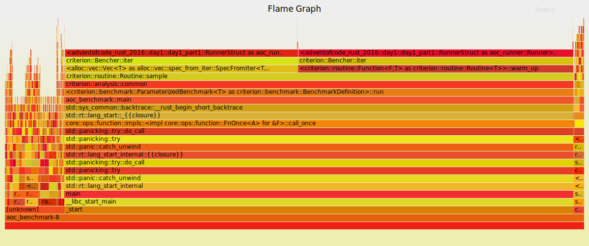
## Day 1 Part 2
### Result : 152
	
- generator: 10.1µs 
	
- runner: 133.201µs

### [Flame Graph](flamegraph-day1-2.svg):
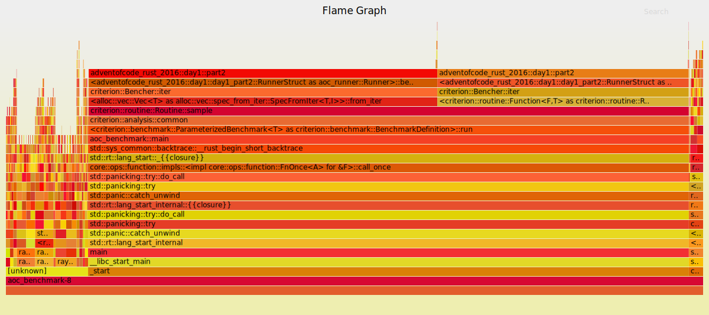
# 📅 [Day 2: Bathroom Security](https://adventofcode.com/2016/day/2)
- [Solution Source](https://github.com/arturh85/adventofcode-rust-2016/blob/master/src/day2.rs)
## Day 2 Part 1
### Result : 35749
	
- generator: 23.5µs 
	
- runner: 86.401µs

### [Flame Graph](flamegraph-day2-1.svg):
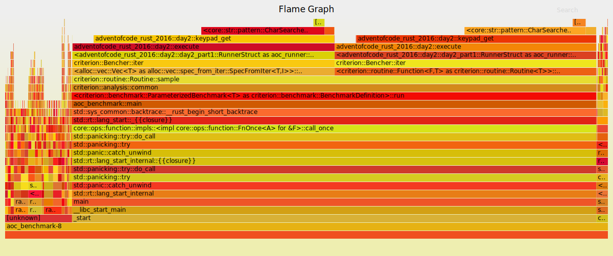
## Day 2 Part 2
### Result : 9365C
	
- generator: 22.8µs 
	
- runner: 154.602µs

### [Flame Graph](flamegraph-day2-2.svg):
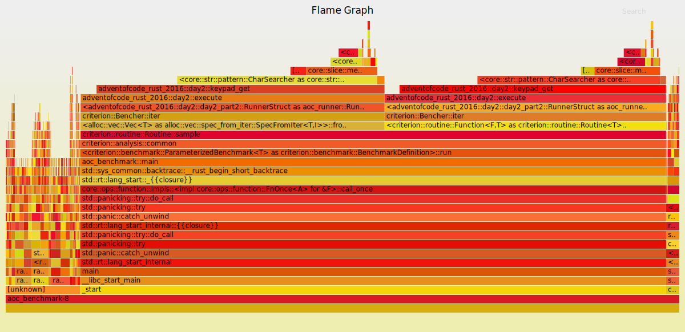
# 📅 [Day 3: Squares With Three Sides](https://adventofcode.com/2016/day/3)
- [Solution Source](https://github.com/arturh85/adventofcode-rust-2016/blob/master/src/day3.rs)
## Day 3 Part 1
### Result : 1032
	
- generator: 685.109µs 
	
- runner: 10µs

### [Flame Graph](flamegraph-day3-1.svg):
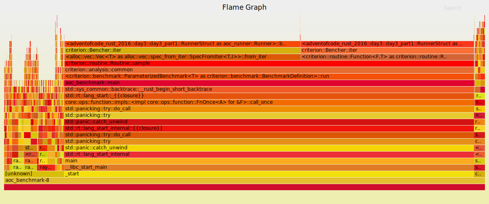
## Day 3 Part 2
### Result : 1838
	
- generator: 647.609µs 
	
- runner: 37.801µs

### [Flame Graph](flamegraph-day3-2.svg):
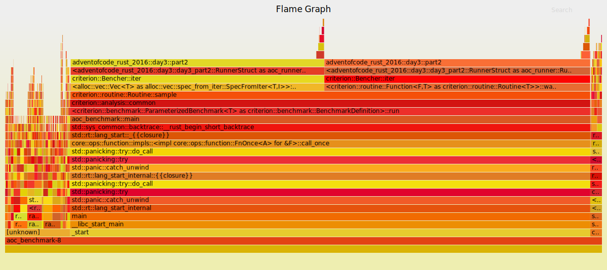
# 📅 [Day 4: Security Through Obscurity](https://adventofcode.com/2016/day/4)
- [Solution Source](https://github.com/arturh85/adventofcode-rust-2016/blob/master/src/day4.rs)
## Day 4 Part 1
### Result : 185371
	
- generator: 2.854933ms 
	
- runner: 3.411339ms

### [Flame Graph](flamegraph-day4-1.svg):
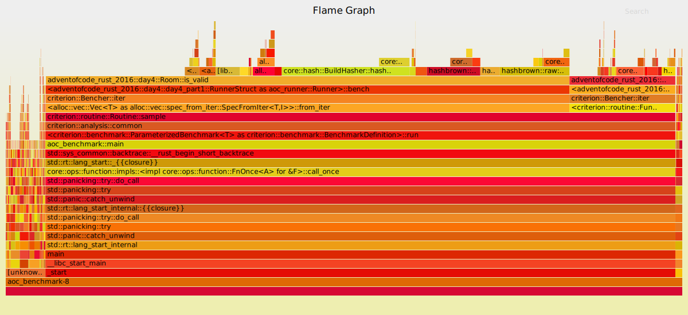
## Day 4 Part 2
### Result : 984
	
- generator: 2.899535ms 
	
- runner: 304.403µs

### [Flame Graph](flamegraph-day4-2.svg):
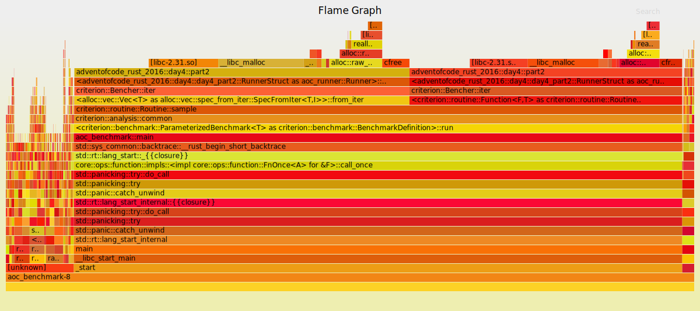
# 📅 [Day 5: How About a Nice Game of Chess?](https://adventofcode.com/2016/day/5)
- [Solution Source](https://github.com/arturh85/adventofcode-rust-2016/blob/master/src/day5.rs)
## Day 5 Part 1
### Result : 2414bc77
	
- generator: 300ns 
	
- runner: 1.744046089s

- 🤯 Flame Graph generation took longer than three minutes.
## Day 5 Part 2
### Result : 437e60fc
	
- generator: 300ns 
	
- runner: 5.117698108s

- 🤯 Flame Graph generation took longer than three minutes.
# 📅 [Day 6: Signals and Noise](https://adventofcode.com/2016/day/6)
- [Solution Source](https://github.com/arturh85/adventofcode-rust-2016/blob/master/src/day6.rs)
## Day 6 Part 1
### Result : agmwzecr
	
- generator: 200ns 
	
- runner: 257.002µs

### [Flame Graph](flamegraph-day6-1.svg):
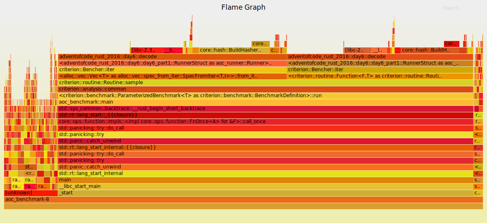
## Day 6 Part 2
### Result : owlaxqvq
	
- generator: 200ns 
	
- runner: 286.302µs

### [Flame Graph](flamegraph-day6-2.svg):
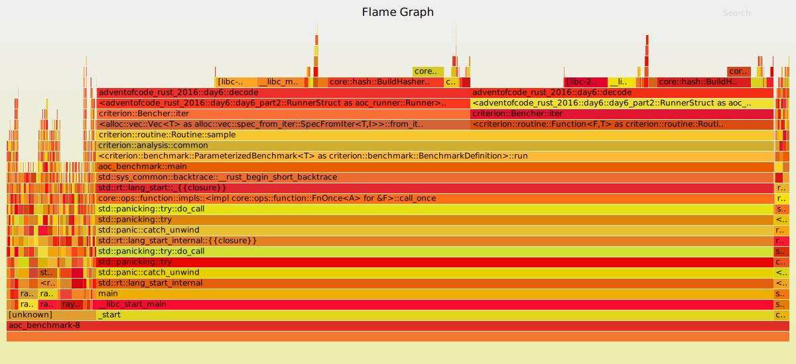
# 📅 [Day 7: Internet Protocol Version 7](https://adventofcode.com/2016/day/7)
- [Solution Source](https://github.com/arturh85/adventofcode-rust-2016/blob/master/src/day7.rs)
## Day 7 Part 1
### Result : 110
	
- generator: 3.680875ms 
	
- runner: 8.824879ms

### [Flame Graph](flamegraph-day7-1.svg):
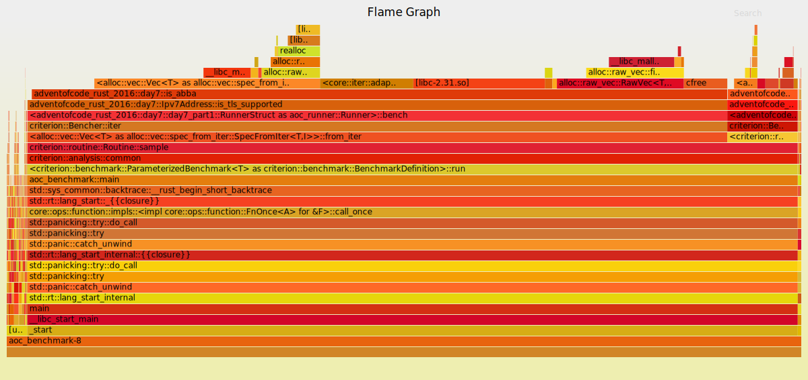
## Day 7 Part 2
### Result : 242
	
- generator: 3.733145ms 
	
- runner: 6.420576ms

### [Flame Graph](flamegraph-day7-2.svg):
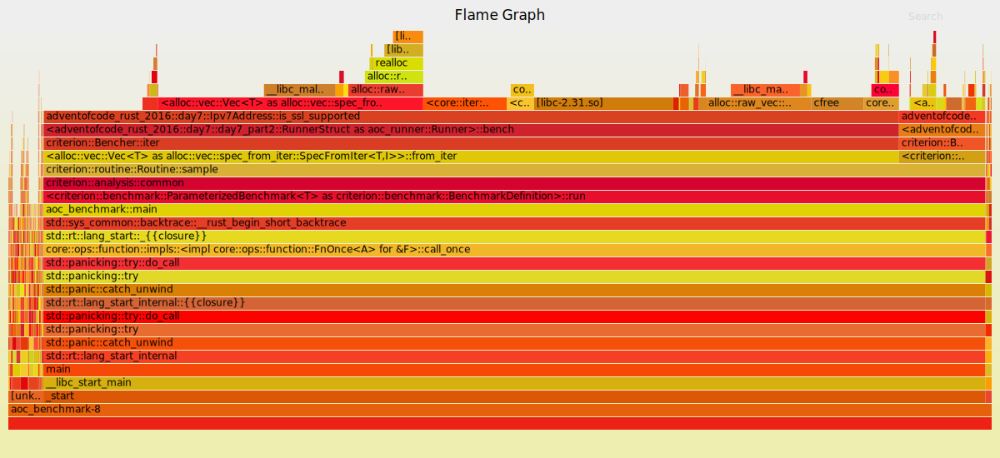
# 📅 [Day 8: Two-Factor Authentication](https://adventofcode.com/2016/day/8)
- [Solution Source](https://github.com/arturh85/adventofcode-rust-2016/blob/master/src/day8.rs)
## Day 8 Part 1
### Result : 110
	
- generator: 501.406µs 
	
- runner: 10.2µs

### [Flame Graph](flamegraph-day8-1.svg):
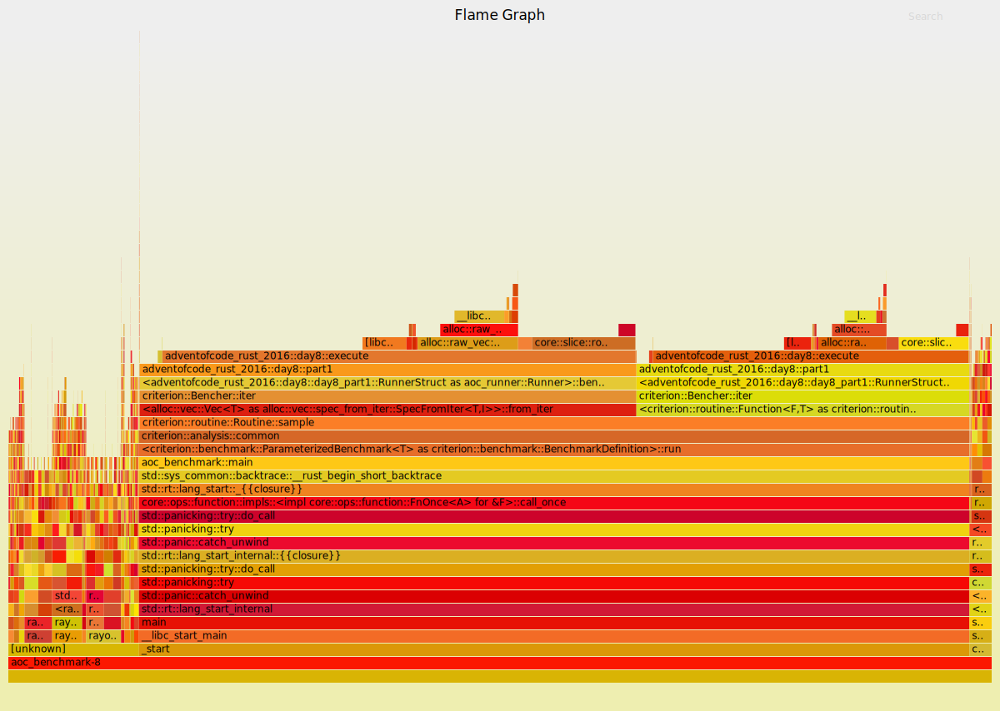
## Day 8 Part 2
####   ## #  # ###  #  #  ##  ###  #    #   #  ## 
   #    # #  # #  # # #  #  # #  # #    #   #   # 
  #     # #### #  # ##   #    #  # #     # #    # 
 #      # #  # ###  # #  #    ###  #      #     # 
#    #  # #  # # #  # #  #  # #    #      #  #  # 
####  ##  #  # #  # #  #  ##  #    ####   #   ##  
### Result : ZJHRKCPLYJ
	
- generator: 526.707µs 
	
- runner: 27.4µs

### [Flame Graph](flamegraph-day8-2.svg):
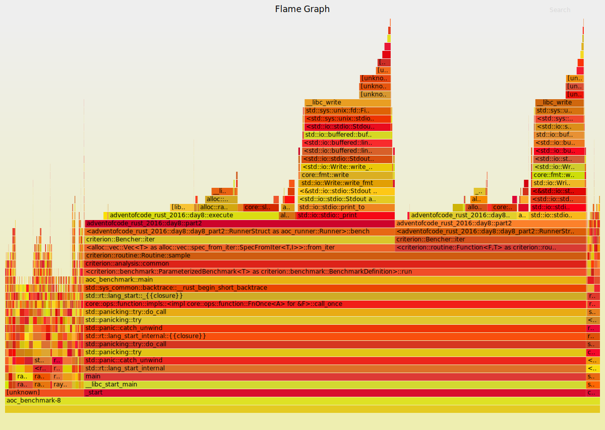
# 📅 [Day 9: Explosives in Cyberspace](https://adventofcode.com/2016/day/9)
- [Solution Source](https://github.com/arturh85/adventofcode-rust-2016/blob/master/src/day9.rs)
## Day 9 Part 1
### Result : 152851
	
- generator: 200ns 
	
- runner: 200.402µs

### [Flame Graph](flamegraph-day9-1.svg):
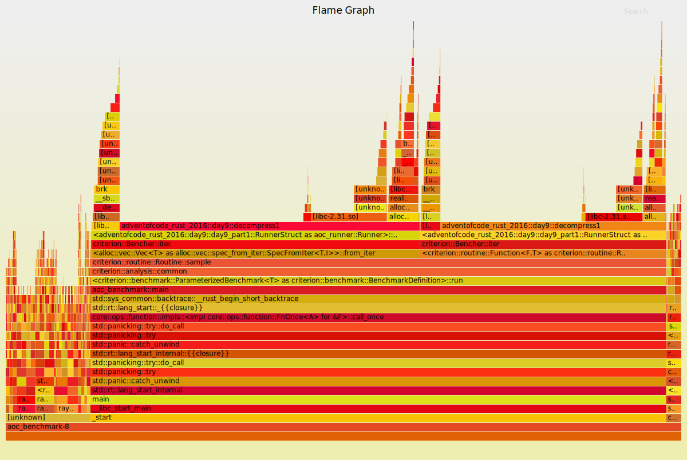
# 📅 [Day 10: Balance Bots](https://adventofcode.com/2016/day/10)
- [Solution Source](https://github.com/arturh85/adventofcode-rust-2016/blob/master/src/day10.rs)
## Day 10 Part 1
### Result : 73
	
- generator: 1.785821ms 
	
- runner: 67.301µs

### [Flame Graph](flamegraph-day10-1.svg):
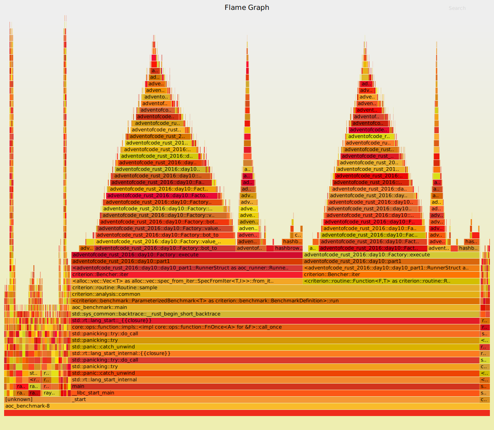
## Day 10 Part 2
### Result : 3965
	
- generator: 1.781422ms 
	
- runner: 67.201µs

### [Flame Graph](flamegraph-day10-2.svg):
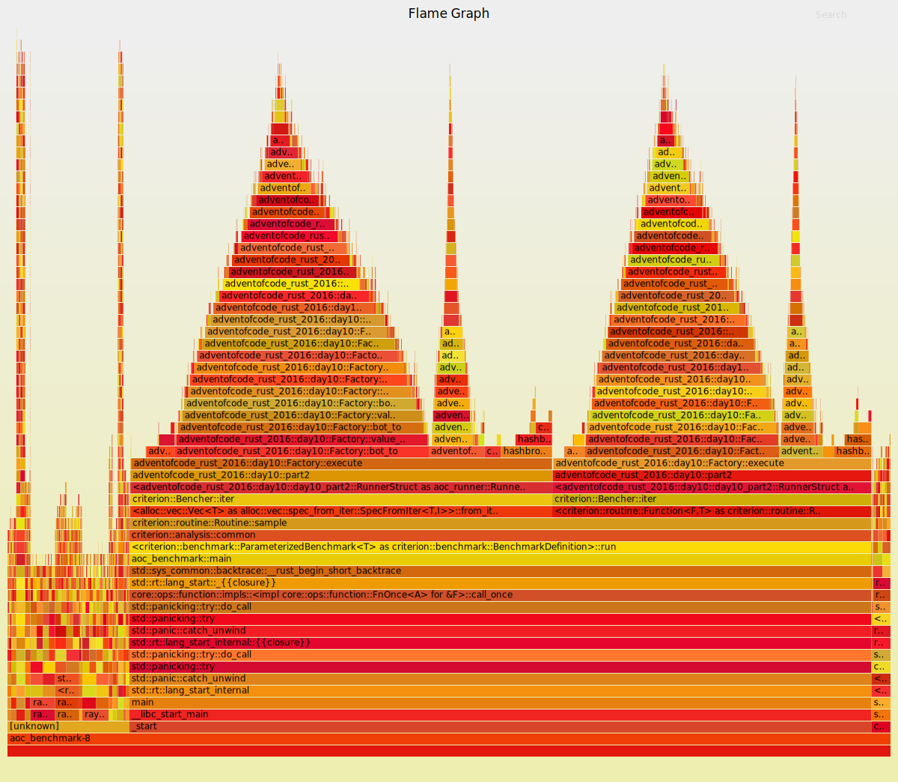
